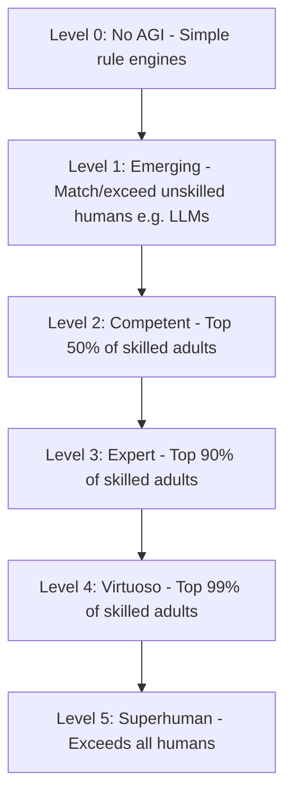

# Module 1: AI vs AGI

As an AI Engineer, it is crucial to understand where current technology stands on the spectrum of intelligence. This module outlines the progression from Narrow Artificial Intelligence (ANI) to Generative AI (GenAI), and ultimately to Artificial General Intelligence (AGI).

---

## 1. Defining the Spectrum of Intelligence

We categorize AI development into three major paradigms:

```
+------------------------------------+------------------------------------+------------------------------------+
|  Narrow AI (ANI)                   |  Generative AI (GenAI)             |  Artificial General Intelligence   |
|  Single-task, rule-bound or pattern|  Multi-task, context-aware systems |  Human-level generalization,      |
|  recognition.                      |  capable of synthesizing content.  |  autonomous reasoning, and agency. |
+------------------------------------+------------------------------------+------------------------------------+
```

### Artificial Narrow Intelligence (ANI)
* **Definition**: AI systems designed to perform a specific task (e.g., classification, playing chess, translation) without general capability.
* **Core Characteristics**:
  * Highly optimized for a single objective.
  * Lacks adaptability; a chess engine cannot write an email.
  * Static heuristics or supervised machine learning models (e.g., CNNs, ResNets).

### Generative AI (GenAI)
* **Definition**: A bridge paradigm powered by Foundation Models (like LLMs) that can generate text, code, images, and audio.
* **Core Characteristics**:
  * Multi-task capabilities out-of-the-box (zero-shot learning).
  * Highly adaptive via natural language interfaces (prompting).
  * Exhibits emergent properties (e.g., in-context learning, basic logical reasoning).

### Artificial General Intelligence (AGI)
* **Definition**: A hypothetical agent that can match or exceed human cognitive performance across a broad range of tasks, including learning, reasoning, and adapting to entirely new environments autonomously.
* **Core Characteristics**:
  * Transfer learning across disparate domains.
  * Long-term planning and recursive self-improvement.
  * True understanding, reasoning, and environment-independent problem-solving.

---

## 2. Comparing Key Attributes

| Attribute | Narrow AI (ANI) | Generative AI (GenAI) | AGI (Goal) |
| :--- | :--- | :--- | :--- |
| **Generalization** | None (Locked to domain) | Medium (Fitted to language/multimodal patterns) | High (Cross-domain execution) |
| **Data Requirements** | Large labelled datasets per task | Massive unsupervised pre-training dataset | Few-shot or self-supervised learning |
| **Autonomy & Agency** | None (Requires developer wiring) | Low to Medium (Basic agent loops like ReAct) | High (Goal-directed planning and execution) |
| **Failure Modes** | Complete breakdown on out-of-distribution data | Hallucination, alignment drift, fragile prompts | Unknown (alignment and safety critical) |

---

## 3. DeepMind’s Levels of AGI

Google DeepMind proposed a classification framework to track the path toward AGI based on **performance** and **generality**:



* **Generality Spectrum**:
  * **Narrow**: Specialized to one task domain.
  * **General**: Able to learn and execute any cognitive task a human can.

---

## 4. The AI Engineer's Perspective

For an AI Engineer, distinguishing these paradigms dictates engineering practices:

1. **Practical System Building (Today)**:
   - We do not wait for AGI. Instead, we use GenAI models as modular cognitive processors within traditional software architectures (using RAG, prompt engineering, and agent patterns).
2. **Deterministic Wrappers for Stochastic Cores**:
   - Because current LLMs are statistical estimators (next-token predictors), they lack deterministic certainty. AI Engineers design validation steps, guardrails, and sandboxes to manage this stochastic behavior.
3. **Designing for Future Agency**:
   - As models improve in reasoning and planning, engineering designs must move toward **Agentic Orchestration**—where models can autonomously call APIs, write temporary scripts, and handle complex exceptions.
