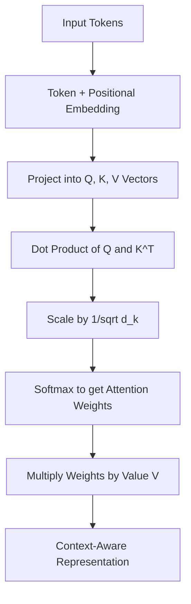
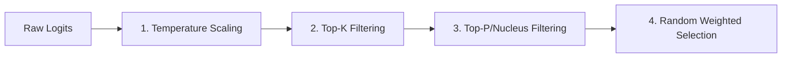

# Module 2: Large Language Models (LLMs)

Large Language Models (LLMs) are the primary engines powering modern AI systems. As an AI Engineer, understanding how they process text, predict tokens, and respond to configurations is fundamental to building reliable applications.

---

## 1. The Transformer Architecture

Modern LLMs are built on the **Transformer** architecture (introduced by Vaswani et al. in 2017). The core mechanism is **Self-Attention**, which allows the model to look at other words in a sequence to better understand the context of a specific word.

### Self-Attention Mechanism

For every token, the model projects its embedding into three vectors:
1. **Query ($Q$)**: "What am I looking for?"
2. **Key ($K$)**: "What information do I contain?"
3. **Value ($V$)**: "What information do I pass along if selected?"

The similarity between a Query and a Key determines the attention weight. The final representation is a weighted sum of the Values.

$$\text{Attention}(Q, K, V) = \text{softmax}\left(\frac{QK^T}{\sqrt{d_k}}\right)V$$



### Architectural Variations

Depending on how Attention is wired, Transformers are grouped into three architectures:

1. **Encoder-Only (e.g., BERT)**
   - *Behavior*: Bidirectional attention (looks left and right).
   - *Best For*: Sentiment analysis, classification, extraction.
2. **Decoder-Only (e.g., GPT, Llama, Mistral, Claude)**
   - *Behavior*: Causal/Unidirectional attention (looks only at past tokens).
   - *Best For*: Text generation, chatting, coding. **Nearly all modern generative LLMs are Decoder-Only.**
3. **Encoder-Decoder (e.g., T5, BART)**
   - *Behavior*: Encodes source text bidirectionally, then decodes output text causally.
   - *Best For*: Translation, summarization.

---

## 2. Tokenization

Models do not read text directly; they process **Tokens**, which are sub-word units generated by a tokenizer (e.g., Byte-Pair Encoding or SentencePiece).

```
Raw Text:    "AI Engineering is fun!"
Tokens:      ["AI", " Engineering", " is", " fun", "!"]
Token IDs:   [12543, 2341, 318, 1432, 0]
```

### Engineering Implications of Tokenization

* **Token-to-Word Ratio**: Roughly, 1 token $\approx$ 0.75 words (or 100 tokens $\approx$ 75 words in English). Non-English languages often require significantly more tokens per word due to smaller representation in the training vocabulary.
* **Character Manipulation**: Because LLMs process tokens and not raw characters, they struggle with character-level tasks (e.g., spelling a word backwards, counting letters in a word) unless prompted with spacing or step-by-step logic.
* **Cost & Constraints**: APIs charge per token. Context limits are enforced in tokens, not words.

---

## 3. Key API Hyperparameters

When sending a request to an LLM API, you control how the model samples tokens from its probability distribution.



| Hyperparameter | Description | Recommended Defaults |
| :--- | :--- | :--- |
| **Temperature** | Controls the randomness of the prediction. A low temperature (e.g., `0.1`) flattens the distribution towards high-probability tokens (more deterministic). A high temperature (e.g., `0.8` to `1.0`) spreads out probabilities (more creative). | `0.0` for structured extraction/coding.<br>`0.7` for general conversation/brainstorming. |
| **Top-P (Nucleus)** | Samples from the smallest set of tokens whose cumulative probability exceeds `P`. Helps avoid selecting completely nonsense tokens. | Keep at `1.0` if adjusting Temperature, or set to `0.9` (do not highly alter both). |
| **Top-K** | Limits sampling to the top `K` most probable tokens. | Commonly set to `40` or `50` by default. |
| **Frequency Penalty** | Penalizes new tokens based on their existing frequency in the generated text so far. Prevents repetitive loops. | `0.0` default. Range: `-2.0` to `2.0`. |
| **Presence Penalty** | Penalizes new tokens if they have already appeared in the text at least once. Encourages introducing new topics. | `0.0` default. Range: `-2.0` to `2.0`. |
