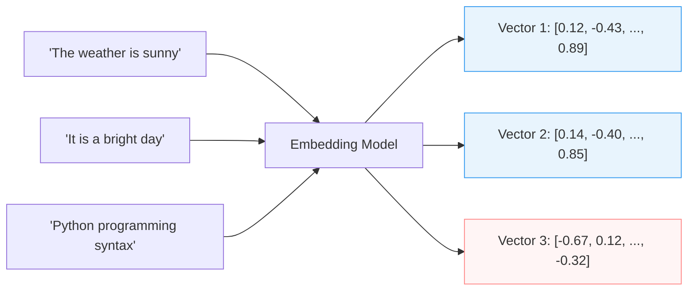
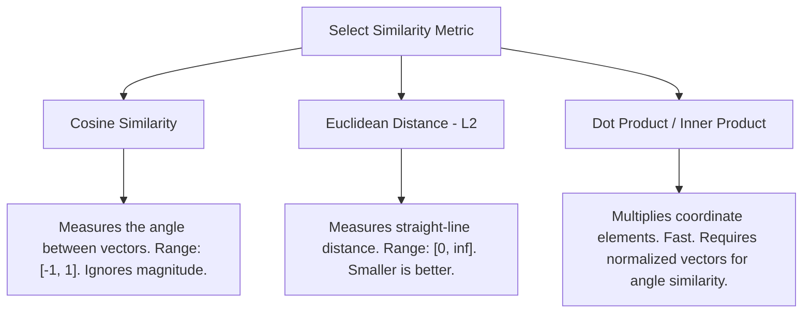

# Module 3: Embeddings

Embeddings are the foundation of semantic understanding in AI Engineering. They translate unstructured data (text, images, audio) into list of numbers (vectors) that capture the underlying semantic meaning.

---

## 1. What are Embeddings?

An embedding maps a token, sentence, or document into a point in a **high-dimensional vector space** (often between 384 and 3072 dimensions depending on the model). 

* **Semantic Alignment**: Words or sentences with similar meanings or contexts are placed close together in this vector space. For example, "king" and "queen" will be closer to each other than "king" and "banana".

*In the high-dimensional space:*
* $\text{Vector 1}$ and $\text{Vector 2}$ will have high similarity.
* $\text{Vector 3}$ will have very low similarity to both $\text{Vector 1}$ and $\text{Vector 2}$.

---

## 2. Similarity Metrics

To measure how semantically similar two texts are, we compute the distance/angle between their embedding vectors:

### 1. Cosine Similarity
Calculates the cosine of the angle between two vectors. It measures orientation, completely ignoring the magnitude of the vectors.

$$\text{Cosine Similarity}(\vec{u}, \vec{v}) = \frac{\vec{u} \cdot \vec{v}}{\|\vec{u}\| \|\vec{v}\|}$$

* If vectors are unit-normalized (magnitude $= 1$), then Cosine Similarity is simply the **Dot Product** ($\vec{u} \cdot \vec{v}$).

### 2. Euclidean Distance (L2)
Measures the straight-line distance between two points in Euclidean space. 

$$\text{Euclidean Distance}(\vec{u}, \vec{v}) = \sqrt{\sum_{i=1}^n (u_i - v_i)^2}$$

* A smaller distance means higher similarity. Unlike Cosine Similarity, L2 is sensitive to vector magnitude.

### 3. Dot Product
Computes the sum of the products of corresponding elements.

$$\text{Dot Product}(\vec{u}, \vec{v}) = \sum_{i=1}^n u_i v_i$$

* Highly efficient to calculate. Used heavily when speed is critical and vectors are normalized beforehand.

---

## 3. Engineering Decisions & Trade-Offs

When building systems using embeddings, AI Engineers face several decisions:

### A. Dimensionality vs. Latency vs. Storage
* Modern models (like OpenAI's `text-embedding-3-large`) allow you to truncate dimensions (e.g., from 3072 to 1024 or 512) using techniques like Matryoshka Representation Learning.
* **Trade-off**: Lower dimensionality reduces storage requirements in Vector DBs and speeds up similarity search, but sacrifices minor retrieval accuracy (recalls).

### B. Choosing the Right Chunk Size
* An embedding model has a maximum token limit (e.g., 8192 tokens).
* If you embed a whole book in one vector, you lose specificity (it will match general themes but not exact quotes).
* **Best practice**: Chunk document texts into smaller pieces (e.g., 256 or 512 tokens) with an overlap (e.g., 10-20%) before embedding.

### C. Local vs. API Models
* **API Models (e.g., OpenAI, Cohere)**: High performance, zero setup, but recurring network latency and cost per token.
* **Local Models (e.g., Hugging Face SentenceTransformers like BGE or MXBAI)**: Free, highly secure (on-premise), extremely fast, but requires hosting hardware (GPU/CPU memory).
