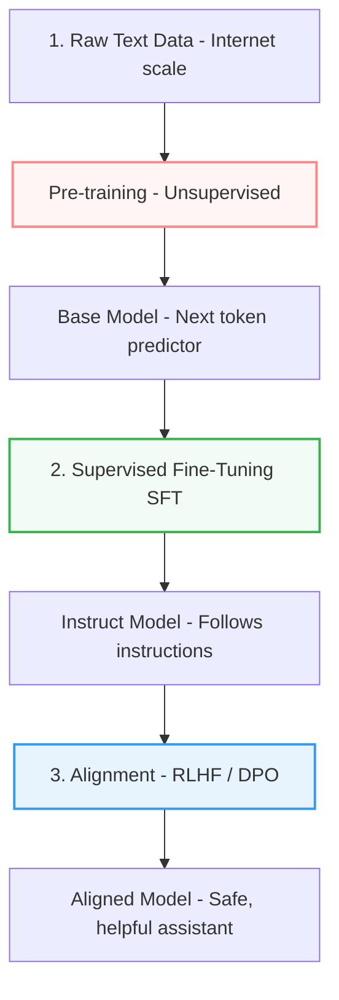

# Module 4: Training LLMs

While AI Engineers rarely train large foundation models from scratch, understanding the training lifecycle—from raw web data to an aligned chat assistant—is critical for debugging model behavior, selecting base models, and understanding downstream fine-tuning.

---

## 1. The Three Stages of LLM Training

Creating a production-ready LLM (like GPT-4 or Llama 3) involves three sequential stages:

### Stage 1: Pre-training (Unsupervised Learning)
* **Goal**: Learn language, world facts, grammar, and reasoning patterns.
* **Method**: Self-supervised learning. The model is given a sequence of tokens and must predict the next token (Causal Language Modeling).
* **Dataset**: Terabytes of text (Common Crawl, Wikipedia, books, code repositories).
* **Output**: **Base Model** (also known as Foundation Model). 
  * *Behavior*: If you type a question like `"What is the capital of France?"`, a base model might respond with `"What is the capital of Spain? What is the capital of Germany?"` because it tries to complete the pattern of list-like text, not answer the question.

### Stage 2: Supervised Fine-Tuning (SFT / Instruction Tuning)
* **Goal**: Teach the model to act like a helpful assistant and follow instructions.
* **Method**: Supervised learning on curated data. 
* **Dataset**: Tens of thousands of high-quality `{"instruction": "...", "response": "..."}` pairs written by human experts or generated by stronger teacher models.
* **Output**: **Instruct / Chat Model**. It now answers questions, translates text, and formats output correctly.

### Stage 3: Alignment (RLHF / DPO)
* **Goal**: Align model outputs with human values (safety, helpfulness, honesty, tone).
* **Method**:
  * **RLHF (Reinforcement Learning from Human Feedback)**: A reward model is trained on human preference data (rating which model output is better). An RL algorithm (PPO) then optimizes the LLM policy to maximize reward.
  * **DPO (Direct Preference Optimization)**: A newer, simpler approach that bypasses the separate reward model, optimizing the LLM directly on pairwise preference data (worse response vs. better response).
* **Output**: **Safety-Aligned Model** (refuses to assist with illegal acts, limits toxic language).

---

## 2. Compute Scaling & Hardware

Training large models requires massive computational power. 

### Compute Math (FLOPs)
Estimating compute for pre-training a model with $P$ parameters on $N$ tokens:

$$\text{Compute (FLOPs)} \approx 6 \times P \times N$$

* **Chinchilla Scaling Laws**: For optimal training efficiency under a fixed compute budget, the number of parameters ($P$) and the number of training tokens ($N$) should scale in equal proportion. Roughly, models should be trained on $\approx 20$ tokens per parameter. Modern LLMs are often "overtrained" (e.g., Llama 3 8B trained on 15T tokens, $\approx 1800$ tokens per parameter) to keep inference costs low.

### Training Hardware
* **GPUs**: NVIDIA H100, A100, and Blackwell B200.
* **TPUs**: Google Tensor Processing Units.
* **Interconnects**: High-speed communication (like NVLink) is essential because models are split across hundreds or thousands of GPUs (Tensor Parallelism, Pipeline Parallelism, ZeRO Zealous Redundancy Optimizer).
