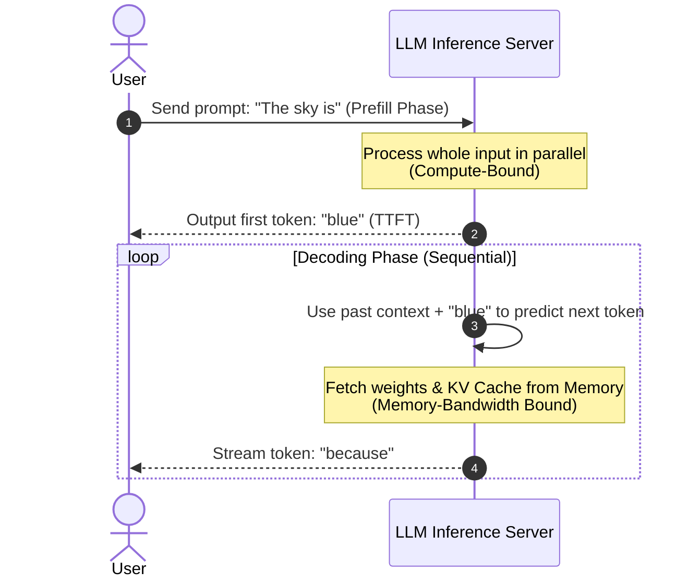

# Module 5: Inference Optimization

Inference is the phase where a trained model processes user queries and generates responses. As an AI Engineer, optimizing inference is critical for controlling infrastructure costs and delivering a responsive, low-latency user experience.

---

## 1. Key Performance Metrics

When measuring LLM inference performance, we track three main metrics:

```
+---------------------------------------------------------------------------------------------------------+
|                                    Inference Performance Metrics                                        |
+---------------------------------------------------+-----------------------------------------------------+
| Metric                                            | Why it Matters                                      |
+---------------------------------------------------+-----------------------------------------------------+
| Time to First Token (TTFT)                        | User-perceived responsiveness (UI loading spinners).|
| Tokens Per Second (TPS)                           | Reading comfort; how fast the text streams.         |
| Throughput (Tokens/sec/GPU)                       | Cost efficiency; capacity to handle concurrent users|
+---------------------------------------------------+-----------------------------------------------------+
```

---

## 2. Prefill vs. Decode Phase

LLM inference operates in two distinct phases:



1. **Prefill Phase (Compute-Bound)**: 
   - The model processes the entire input prompt at once to compute keys and values.
   - Leverages parallelization on GPUs.
   - Dictates **TTFT**.
2. **Decoding Phase (Memory-Bound)**:
   - The model generates tokens sequentially, one by one.
   - For every single token generated, the model must read all weights and previous token states (KV Cache) from High Bandwidth Memory (HBM) to the GPU compute cores.
   - Dictates **TPS**.

---

## 3. Core Optimization Techniques

AI Engineers and infrastructure engineers use several techniques to speed up inference and lower memory footprint:

### A. KV Caching (Key-Value Caching)
During decoding, the model needs to calculate self-attention. Instead of re-calculating the Key ($K$) and Value ($V$) vectors for the entire prompt history at every step, we cache them in memory.
* **Cost**: Highly memory-consuming. High context length with many parallel users can quickly run out of GPU VRAM due to large KV cache size.

### B. PagedAttention & vLLM
* Traditionally, KV cache memory had to be allocated contiguously, leading to high memory fragmentation (up to 60-80% wasted VRAM).
* **PagedAttention** (developed by UC Berkeley / implemented in vLLM) partitions the KV cache into logical blocks, resembling virtual memory paging in OS. It allows sharing memory blocks (e.g. for multiple outputs of the same prompt).

### C. Quantization
Reduces the precision of model weights from 16-bit floating point (`FP16` or `BF16`) to 8-bit (`INT8`) or 4-bit (`INT4`) integers.
* **Benefits**:
  * Reduces VRAM footprint (e.g., a 70B parameter model at FP16 requires 140GB VRAM; at INT4 it only requires ~35GB).
  * Speeds up memory retrieval, alleviating the memory bandwidth bottleneck.
* **Formats**: AWQ, GPTQ (for GPU/server deployment), GGUF (optimized for CPU/local devices).

### D. Speculative Decoding
Uses a small, fast "draft" model to generate a sequence of token candidates (e.g., 5 tokens). A large "target" model validates all 5 tokens in parallel in a single forward pass.
* If the target model approves them, they are accepted instantly, reducing sequential decoding steps.

---

## 4. Serving Infrastructure Trade-offs

| Hosting Type | Pros | Cons | Ideal For |
| :--- | :--- | :--- | :--- |
| **Serverless API** *(e.g., OpenAI, Anthropic)* | Pay-per-token, zero maintenance, scales to infinity. | Variable latency, data privacy concerns, rate limits. | MVPs, low/unpredictable traffic, general applications. |
| **Dedicated Endpoints** *(e.g., Anyscale, RunPod, Hugging Face)* | Predictable pricing for high volume, custom model weights. | Cold starts, paying for idle time if traffic drops. | Consistent, high-throughput systems, custom fine-tuned models. |
| **On-Premise / Self-Hosted** *(e.g., vLLM, TGI)* | Maximum security/privacy, no network latency to external APIs. | High upfront hardware cost, maintenance complexity. | Enterprise compliance, strict low-latency requirements. |
