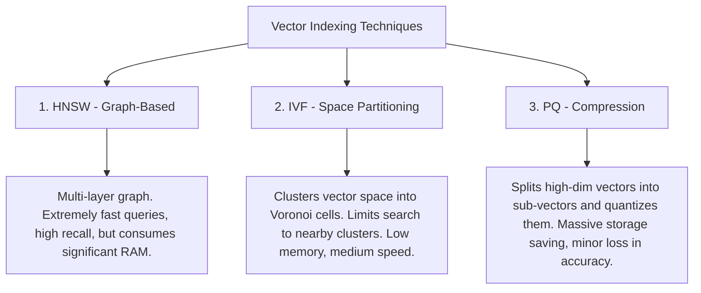
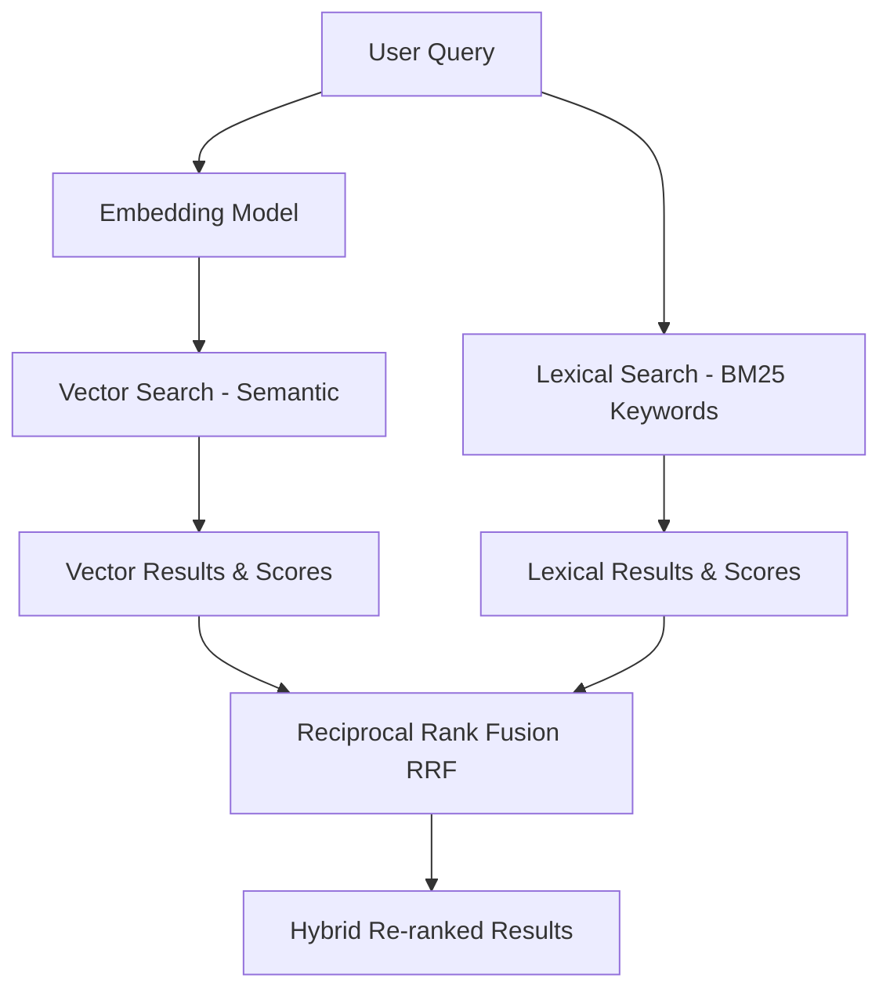

# Module 6: Vector Databases

As an AI Engineer, a Vector Database is one of your primary data stores. While traditional relational databases index scalar fields (strings, integers) using B-Trees, Vector Databases index high-dimensional vectors to allow semantic similarity search at scale.

---

## 1. Why Vector Databases?

Traditional databases are designed for exact matches (e.g., `WHERE age = 30` or `WHERE name LIKE 'Alice%'`). 
If you query a traditional database for `"happy customer"`, it will not return rows containing `"joyful client"` unless you explicitly write complex synonym rules. 

A Vector DB stores embedding vectors of these phrases and performs **Approximate Nearest Neighbors (ANN)** search to find semantically similar entries in milliseconds, even across billions of vectors.

---

## 2. Core Indexing Algorithms (ANN)

To search through millions of vectors instantly, Vector DBs construct specialized indexes. The three most common index designs are:

### A. Hierarchical Navigable Small World (HNSW)
* **Concept**: Creates a multi-layer graph where the top layers have long-range links (skip lists) for fast traversal, and the bottom layers have short-range links for fine-grained local search.
* **Trade-off**: Requires keeping the graph in RAM, making it memory-intensive but highly accurate and fast.

### B. Inverted File Index (IVF)
* **Concept**: Partitions the vector space into clusters using k-means. During query time, the system identifies the closest cluster centroids and only searches within those specific clusters.
* **Trade-off**: Much smaller memory footprint than HNSW, but slightly slower search times.

### C. Product Quantization (PQ)
* **Concept**: A lossy compression technique that maps vectors to codebooks, reducing the size of vectors (e.g. by 95%).
* **Trade-off**: Drastically cuts down memory requirements and hosting cost, but introduces noise and lowers query recall.

---

## 3. Search Types: Vector vs. Lexical vs. Hybrid

Modern search engines rarely rely on vector search alone. They combine multiple search methodologies.

1. **Vector Search (Semantic)**: Finds conceptual matches (e.g. query: "device issues" matches document: "phone screen is cracked").
2. **Lexical Search (Keyword / BM25)**: Finds exact matches (e.g. query: "iPhone 15 Pro Max" matches exactly "iPhone 15 Pro Max"). Vector search can struggle with exact serial numbers, product names, or acronyms.
3. **Hybrid Search**: Runs both Vector and Lexical search in parallel, then combines the scores using **Reciprocal Rank Fusion (RRF)**:

$$\text{RRF Score}(d) = \sum_{m \in M} \frac{1}{k + r_m(d)}$$

Where $r_m(d)$ is the rank of document $d$ in search method $m$, and $k$ is a constant (usually $60$).

---

## 4. Vector Database Ecosystem

Depending on your architecture, you will select from various Vector DB providers:

* **Dedicated Vector Databases**:
  * **Pinecone**: Fully managed, SaaS, scales automatically, excellent developer experience.
  * **Qdrant / Milvus**: Open-source, high performance, can be self-hosted or managed, written in Rust/Go.
* **Relational / Document DB Extensions**:
  * **pgvector**: Postgres extension. Excellent for teams already running PostgreSQL. Keeps metadata and vectors in one relational DB.
  * **Elasticsearch / Opensearch**: Strong for hybrid search when BM25 is the primary requirement and vector search is supplementary.
* **Embedded / Local Databases**:
  * **Chroma / LanceDB**: Run in-process (like SQLite). Ideal for local testing, notebooks, or mobile/desktop apps.
