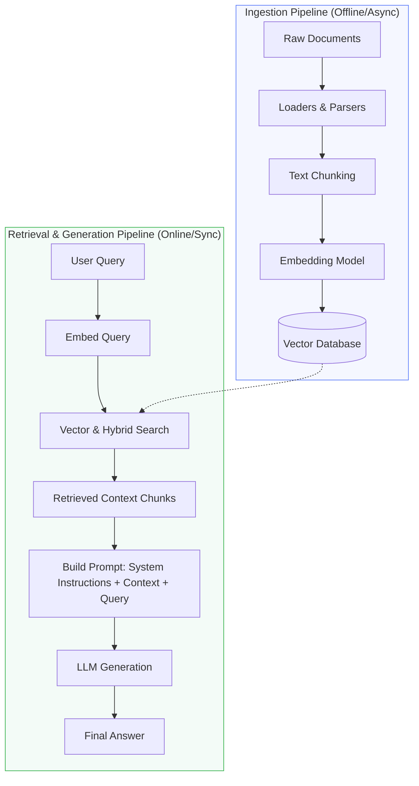

# Module 7: Retrieval-Augmented Generation (RAG)

Retrieval-Augmented Generation (RAG) is one of the most common design patterns implemented by AI Engineers. It optimizes LLM outputs by querying an external knowledge source (e.g., databases, documents) before generating a response, resolving context limitations and hallucinations.

---

## 1. Why RAG?

While LLMs possess vast general knowledge, they have key limitations:
* **Hallucinations**: Models confidently fabricate details when they lack facts.
* **Knowledge Cutoff**: Models cannot access real-time information post-training.
* **No Private Data Access**: Base models do not know about your internal company wikis, databases, or user accounts.

RAG resolves this by turning the LLM into an "open-book" processor:

```
Without RAG:   User Query ──> [ LLM (Relies on Internal Weights) ] ──> Hallucination/Out-of-date Answer

With RAG:      User Query ──> [ Retrieve Relevant Documents ] ──> Combine (Query + Docs) ──> [ LLM ] ──> Fact-grounded Answer
```

---

## 2. The Core RAG Pipeline

A production-grade RAG pipeline consists of two distinct workflows: **Ingestion** and **Retrieval & Generation**.



### A. The Ingestion Pipeline (Offline)
1. **Document Loading**: Extract text from PDFs, Markdown, Word, Notion, or databases.
2. **Chunking**: Break long documents into smaller chunks (e.g., 512 tokens).
   - *Recursive Character Chunking*: Splits by paragraphs, then sentences, then words, until chunk size criteria is met.
   - *Semantic Chunking*: Splits text when the semantic difference between consecutive sentences exceeds a threshold.
3. **Embedding**: Generate vectors for each chunk.
4. **Storage**: Write vectors and metadata (source URL, file name, timestamp) to the Vector DB.

### B. The Retrieval & Generation Pipeline (Online)
1. **Query Embedding**: The user's query is converted to a vector using the same embedding model.
2. **Similarity Search**: Query the Vector DB to retrieve the top $K$ most similar text chunks.
3. **Prompt Augmentation**: Format the prompt by injecting the retrieved chunks as context:
   ```markdown
   You are a helpful assistant. Answer the question using ONLY the provided context.
   ---
   Context:
   [Chunk 1 Text]
   [Chunk 2 Text]
   ---
   Question: [User Query]
   Answer:
   ```
4. **Generation**: The LLM reads the context and answers the question.

---

## 3. Advanced RAG Techniques

Basic RAG often fails in complex scenarios (e.g., vague queries, long documents, multi-step questions). AI Engineers use advanced techniques to optimize search quality:

### A. Re-ranking
* **Problem**: Vector search returns chunks based on vector distance, but the top-3 results might not be the most relevant to answer the query. Passing too many chunks increases costs and can confuse the LLM.
* **Solution**: Retrieve a larger set of candidates (e.g., $K=20$) via fast vector search. Run them through a **Cross-Encoder Re-ranker** (e.g., Cohere Rerank, BGE-Reranker) to evaluate the exact semantic relationship between query and document. Pass only the top 3-5 re-ranked results to the LLM.

```
Query ──> [ Vector Search ] ──> Top 20 Chunks ──> [ Re-ranker Model ] ──> Top 3 Highly Relevant Chunks ──> LLM
```

### B. Query Transformation
* **Sub-Query Generation**: Splitting a complex query ("Compare Q1 sales in US vs EU") into sub-queries ("US Q1 sales", "EU Q1 sales"), retrieving documents for both, and combining results.
* **HyDE (Hypothetical Document Embeddings)**: Directing the LLM to generate a hypothetical "ideal" answer to the query first. The system embeds this hypothetical answer and uses it to query the Vector DB. This works because answer-to-answer vector matching is often closer than query-to-answer matching.

### C. Parent-Child / Sentence-Window Retrieval
* **Problem**: Large chunks contain too much noise, but small chunks lack surrounding context.
* **Solution**: Store small sentences (e.g., 1 sentence chunks) in the Vector DB for precise matching. When a match is found, retrieve the surrounding sentences or the "parent document" (e.g., paragraph) and pass that larger block to the LLM.
