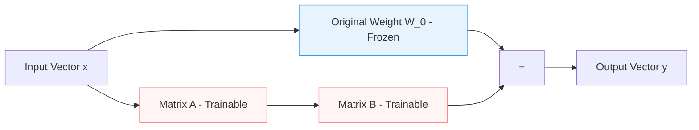
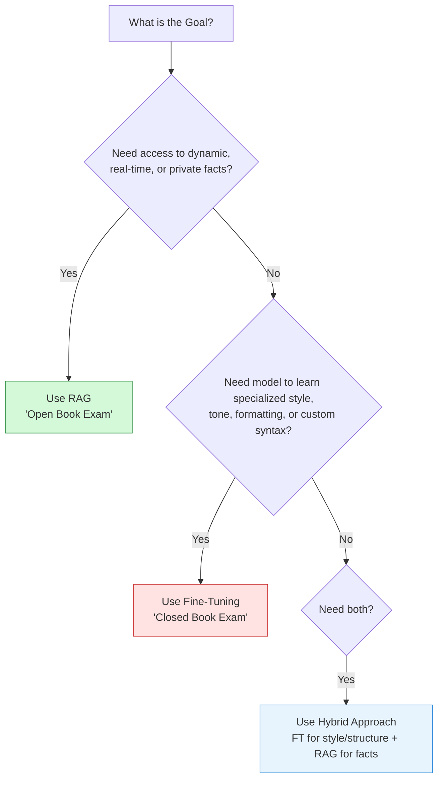

# Module 8: Fine-Tuning

Fine-Tuning is the process of taking an existing pre-trained model and training its weights on a custom dataset. This allows the model to learn specific styles, tones, specialized domain vocabulary, or strictly adhere to output formats (e.g. JSON schemas).

---

## 1. Parameter-Efficient Fine-Tuning (PEFT) & LoRA

Traditionally, fine-tuning meant updating all the weights of a model (Full Fine-Tuning), which requires massive compute clusters and VRAM. Today, AI Engineers use **PEFT** methods to adapt models efficiently.

### LoRA (Low-Rank Adaptation)
Instead of updating the massive weight matrix $W_0$ (size $d \times k$), LoRA freezes the original model weights and decomposes the weight update $\Delta W$ into two smaller, low-rank matrices $A$ and $B$:

$$\Delta W = B \times A$$

Where $B$ is of size $d \times r$ and $A$ is of size $r \times k$. The rank $r$ is a hyperparameter (usually $8$, $16$, or $64$) that is much smaller than $d$ or $k$.



* **Benefits of LoRA**:
  * Reduces trainable parameters by up to 99.9%.
  * Decreases GPU VRAM requirements during training.
  * Allows swapping LoRA "adapters" at inference time on top of a single frozen base model.

### QLoRA (Quantized LoRA)
QLoRA takes LoRA further by quantizing the base model to 4-bit NormalFloat (`NF4`) precision and adding a small set of 16-bit LoRA adapter weights.
* **Impact**: Allows fine-tuning a 70B parameter model on a single 48GB GPU (like an A6000) or a 7B model on a consumer GPU (like an RTX 4090/3090).

---

## 2. RAG vs. Fine-Tuning: The Decision Tree

A common dilemma for AI Engineers is deciding whether to use RAG or Fine-Tuning. 



### Key Distinctions
* **RAG (Open-Book)**: Excellent for factual recall, updating data without re-training, and enforcing document-level access permissions. It does *not* teach the model new behavioral capabilities.
* **Fine-Tuning (Closed-Book)**: Excellent for teaching style, tone, code generation syntax, output formatting (e.g. JSON), and reducing token costs (by removing long system prompts). It is *bad* for learning rapidly changing facts.

---

## 3. Dataset Preparation

Fine-tuning success depends entirely on data quality. The data must match the target model's chat template.

### Example Dataset format (JSONL)
```json
{"messages": [{"role": "system", "content": "You are a specialized SQL assistant."}, {"role": "user", "content": "Get total sales for Q1"}, {"role": "assistant", "content": "SELECT SUM(amount) FROM sales WHERE quarter = 'Q1';"}]}
{"messages": [{"role": "system", "content": "You are a specialized SQL assistant."}, {"role": "user", "content": "List active users"}, {"role": "assistant", "content": "SELECT * FROM users WHERE status = 'active';"}]}
```

### Training Pipeline Checklist
1. **Deduplication & Cleaning**: Remove repetitive or low-quality conversations.
2. **Train/Val Split**: Save 5-10% of the dataset for validation loss tracking.
3. **Format Validation**: Ensure all chat roles (`system`, `user`, `assistant`) are correctly mapped.
4. **Compute Selection**: Choose cloud compute (e.g., RunPod, Lambdalabs, AWS) or serverless training providers (e.g., Together AI, OpenAI Fine-tuning API).
5. **Monitoring**: Track train loss and evaluation loss. If evaluation loss starts rising while training loss is falling, the model is **overfitting** (memorizing the dataset rather than generalizing).
