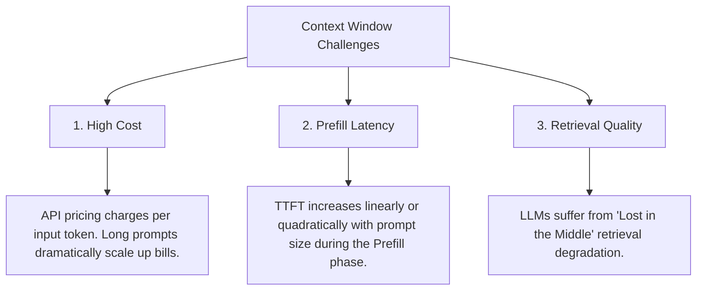
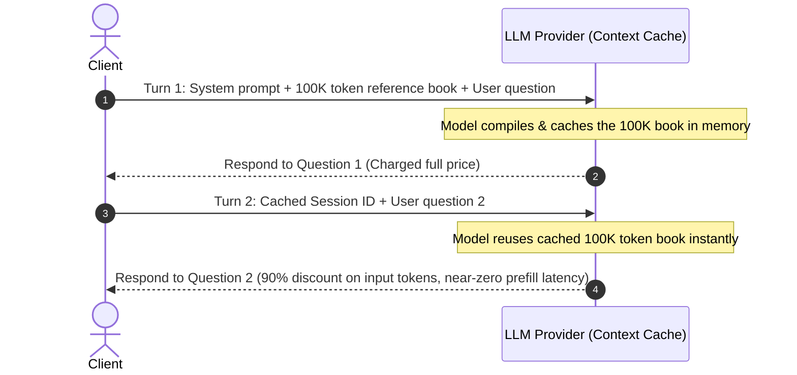

# Module 10: Context Engineering

Context Engineering is the practice of dynamically selecting, formatting, and optimizing the information packed into an LLM's context window. As models support larger context windows (from 128k to 2M+ tokens), managing this space efficiently directly controls costs, latency, and response accuracy.

---

## 1. The Context Window Challenge

While modern LLMs have huge context windows, AI Engineers cannot simply dump entire databases into the prompt for three reasons:



### The "Lost in the Middle" (Needle in a Haystack) Phenomenon
Research shows that LLMs are highly effective at retrieving information located at the very beginning or the very end of a prompt, but struggle to locate facts placed in the middle of a long context.

```
Model Accuracy (%)
100% | \                                                 /
     |  \                                               /
     |   \                                             /
 50% |    \                                           /
     |     \_________________________________________/
  0% +-------------------------------------------------------
     0% (Start)             50% (Middle)            100% (End)
                           Information Position
```

---

## 2. Dynamic Context Assembly

To combat these challenges, AI Engineers build pipelines to package context dynamically:

### A. Context Pruning & Compression
* **Summarization**: Condensing historical messages or documents before injecting them.
* **LLMLingua**: An open-source toolkit that uses a small language model to calculate token surprise (perplexity) and remove redundant tokens, reducing prompt length by up to 50-80% without losing critical meaning.

### B. Structured Context Formatting
Use clear delimiters (like XML tags or JSON structure) so the model can separate instructions, user inputs, and background files:

```markdown
You are a code reviewer. Review the changes in the file provided below.

<file name="auth.py">
def login(username, password):
    ...
</file>

User Query: Find any security bugs in this file.
```

---

## 3. Context Caching

Context Caching is an essential optimization supported by major API providers (e.g., Anthropic, Gemini, OpenAI).



* **How it works**: If a large block of text (e.g. system instructions, API documentation, codebase context) is repeated across multiple API requests, the provider caches the processed keys and values of that text in memory.
* **Impact**:
  * Reduces **TTFT** drastically (bypasses prefill compute).
  * Lowers token costs (typically offering up to a 90% discount for cached input tokens).

---

## 4. State & Session Management

To maintain conversation history in applications, AI Engineers implement memory buffers:

1. **Sliding Window Buffer**: Keeps only the last $N$ messages, discarding older history.
2. **Token Buffer**: Tracks token usage and prunes messages when approaching a set threshold (e.g., keeping only the last 4000 tokens).
3. **Summary Buffer**: Condenses the oldest part of the conversation history into a running paragraph summary, keeping the recent messages in full resolution.
4. **Semantic Memory**: Stores past interactions in a Vector DB and retrieves relevant user memories (e.g., "User prefers dark mode") dynamically based on the current query.
