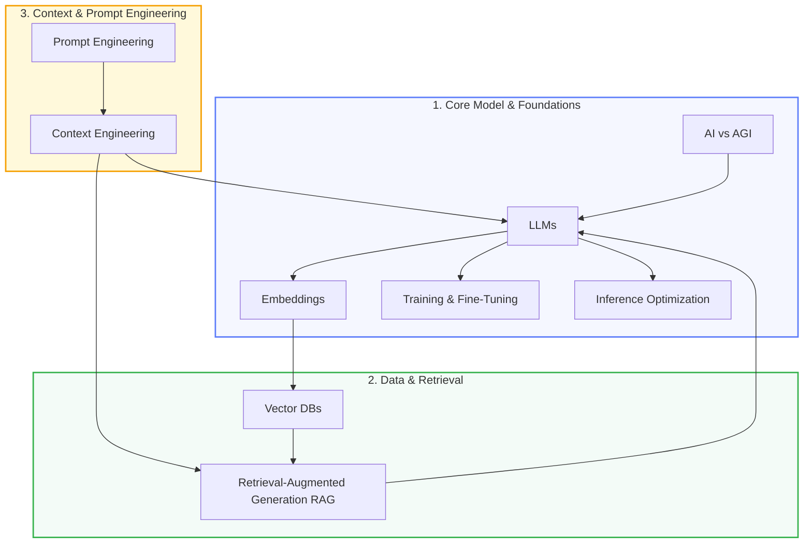

# AI Engineering Knowledge Base

Welcome to your learning repository for the **AI Engineer** role. This space contains structured tutorials, concepts, architectures, and diagrams to help you master the key components of building, deploying, and optimizing applications powered by Large Language Models (LLMs) and Modern AI.

## The Role of an AI Engineer

An **AI Engineer** sits at the intersection of traditional software engineering (APIs, system design, databases, security) and machine learning research (models, weights, context windows, training loops). Rather than designing new model architectures or training core models from scratch, an AI Engineer focuses on:
- **Orchestration**: Designing robust pipelines that feed the right data to the right model at the right time.
- **Optimization**: Balancing cost, latency (TTFT, TPS), and performance (accuracy, alignment).
- **Integration**: Connecting models with databases (Vector DBs), external APIs, tools, and user interfaces.
- **Evaluation**: Implementing rigorous testing setups to evaluate stochastic systems.

---

## Roadmap Overview

Here is how the concepts in this knowledge base connect to form a cohesive system:

---

## Index of Topics

Each module contains deep dives, visual diagrams, and practical engineering trade-offs:

1. **[AI vs AGI](file:///d:/AI%20Engineer%206_2026/AIE_Knowledge/01_ai_vs_agi.md)**
   - Distinguishing Artificial Intelligence, Generative AI, and Artificial General Intelligence.
2. **[LLM Foundations](file:///d:/AI%20Engineer%206_2026/AIE_Knowledge/02_llm.md)**
   - Under the hood of Transformers, Tokenization, and Self-Attention.
3. **[Embeddings](file:///d:/AI%20Engineer%206_2026/AIE_Knowledge/03_embeddings.md)**
   - High-dimensional vector spaces and calculating semantic similarity.
4. **[Training](file:///d:/AI%20Engineer%206_2026/AIE_Knowledge/04_training.md)**
   - Pre-training, compute math, and human alignment (RLHF/DPO).
5. **[Inference](file:///d:/AI%20Engineer%206_2026/AIE_Knowledge/05_inference.md)**
   - Latency, throughput, quantization, KV caching, and speculative decoding.
6. **[Vector DBs](file:///d:/AI%20Engineer%206_2026/AIE_Knowledge/06_vector_dbs.md)**
   - Approximate Nearest Neighbors (ANN), indexes (HNSW, IVF), and hybrid search.
7. **[RAG (Retrieval-Augmented Generation)](file:///d:/AI%20Engineer%206_2026/AIE_Knowledge/07_rag.md)**
   - Ingestion, retrieval, generation, re-ranking, and advanced query parsing.
8. **[Fine-tuning](file:///d:/AI%20Engineer%206_2026/AIE_Knowledge/08_fine_tuning.md)**
   - Parameter-Efficient Fine-Tuning (PEFT), LoRA, QLoRA, and data curation.
9. **[Prompt Engineering](file:///d:/AI%20Engineer%206_2026/AIE_Knowledge/09_prompt_engineering.md)**
   - Few-shot, Chain-of-Thought (CoT), ReAct agent patterns, and prompt evaluation.
10. **[Context Engineering](file:///d:/AI%20Engineer%206_2026/AIE_Knowledge/10_context_engineering.md)**
    - Dynamic context packaging, Needle-in-a-Haystack, cost modeling, and state management.
