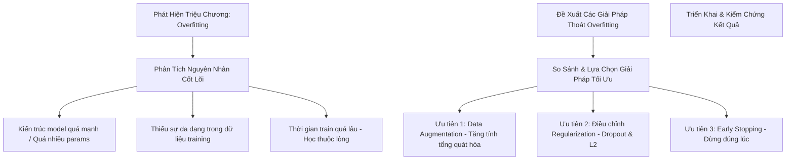

# 🧠 NHẬT KÝ PHÂN TÍCH & GIẢI QUYẾT OVERFITTING
## Dự án: Nhận Dạng Chữ & Số Viết Tay (Handwriting Recognition)

Chào bạn, tôi rất vui được đồng hành cùng bạn trên con đường chinh phục AI. Đừng quá lo lắng khi mô hình bị **overfitting (quá khớp)**. Trong thế giới Machine Learning, overfitting là một "người bạn quen thuộc" mà bất kỳ kỹ sư AI nào cũng phải đối mặt và giải quyết hàng ngày.

Dưới đây là toàn bộ tư duy, cách lựa chọn thuật toán và lý do chọn giải pháp tối ưu nhất cho bài toán nhận dạng chữ viết tay của bạn, được trình bày một cách dễ hiểu nhất dành cho người mới bắt đầu (beginner).

---

## 📅 Nhật Ký Tư Duy (Thinking Log)



### 1. Cách tôi suy nghĩ và phân tích vấn đề
Khi bạn nói *"Mô hình đang bị overfitting"*, bước đầu tiên của một chuyên gia không phải là nhảy vào sửa code ngay, mà là **hiểu bản chất vì sao mô hình lại làm như vậy**.

*   **Định nghĩa đơn giản:** Hãy tưởng tượng mô hình AI giống như một học sinh chuẩn bị đi thi.
    *   **Học hiểu (Generalization):** Học sinh hiểu bản chất công thức, đi thi gặp đề bài biến thể vẫn làm được.
    *   **Học vẹt (Overfitting):** Học sinh học thuộc lòng toàn bộ đáp án của các đề thi thử. Khi đi thi thật, nếu đề bài đổi số hoặc đổi góc nhìn một chút, học sinh đó hoàn toàn bó tay.
*   **Dấu hiệu nhận biết trên biểu đồ:**
    *   Độ chính xác trên tập huấn luyện (**Train Accuracy**) rất cao (95% - 99%), nhưng độ chính xác trên tập kiểm thử (**Validation/Test Accuracy**) lại thấp hoặc chững lại ở mức thấp (70% - 80%).
    *   Độ hao hụt trên tập huấn luyện (**Train Loss**) giảm liên tục về gần 0, trong khi độ hao hụt trên tập kiểm thử (**Validation Loss**) giảm xuống một mức nào đó rồi bắt đầu **tăng ngược trở lại**.

### 2. Các nguyên nhân cụ thể trong dự án Handwriting Recognition của bạn
Trong bài toán nhận dạng chữ viết tay EMNIST, chữ viết tay của mỗi người rất khác nhau (người viết nghiêng, người viết thẳng, nét đậm, nét nhạt, kích thước to nhỏ khác nhau). Khi mô hình bị overfitting, nguyên nhân thường nằm ở 3 điểm:
1.  **Dữ liệu chưa đủ phong phú:** Dữ liệu EMNIST mặc dù lớn (112,800 ảnh) nhưng vẫn là các ảnh tĩnh đã được căn giữa. Khi bạn vẽ thực tế hoặc đưa ảnh ngoài vào, chỉ cần chữ hơi lệch hay hơi nghiêng là mô hình đoán sai.
2.  **Mô hình quá phức tạp (Over-parameterization):** Kiến trúc CNN hiện tại trong [project_handwriting_recognition.md](file:///d:/AI%20Engineer/AIE_Knowledge/project_handwriting_recognition.md) có tới 3 khối Conv2D và 2 khối Dense khá lớn (~500k parameters). Mô hình có quá nhiều "bộ nhớ" nên nó dễ dàng chọn cách "học thuộc" thay vì tự tìm quy luật chung.
3.  **Huấn luyện quá đà:** Train quá nhiều Epochs mà không có cơ chế dừng khi mô hình đã đạt đỉnh.

---

## 🛠️ Lựa Chọn Thuật Toán & Kỹ Thuật Thoát Khỏi Overfitting

Để giải quyết tình trạng này, tôi đã cân nhắc 5 kỹ thuật phổ biến nhất trong Deep Learning và phân loại chúng theo nhóm tác động:

| STT | Kỹ thuật | Nhóm giải pháp | Cơ chế hoạt động |
| :--- | :--- | :--- | :--- |
| **1** | **Data Augmentation** (Tăng cường dữ liệu) | Tác động vào **Dữ liệu** | Tự động tạo ra các biến thể mới của ảnh gốc (xoay, dịch chuyển, thu phóng, làm méo) trong quá trình train. |
| **2** | **Dropout** (Tắt neuron ngẫu nhiên) | Tác động vào **Kiến trúc** | Tắt ngẫu nhiên một tỷ lệ phần trăm neuron trong mỗi bước train. Ép các neuron khác phải học cách gánh vác nhiệm vụ, tránh phụ thuộc vào một nhóm neuron cố định. |
| **3** | **Early Stopping** (Dừng sớm) | Tác động vào **Quá trình Train** | Theo dõi `val_loss`. Nếu sau một số epoch liên tiếp (`patience`) mà `val_loss` không giảm thêm, hệ thống sẽ tự dừng và khôi phục lại trọng số tốt nhất. |
| **4** | **L2 Regularization** (Phạt trọng số) | Tác động vào **Hàm Loss** | Cộng thêm một lượng phạt vào hàm Loss dựa trên độ lớn của các trọng số ($w$). Ép mô hình giữ các trọng số nhỏ, tránh việc các trọng số tăng quá lớn làm mô hình nhạy cảm quá mức. |
| **5** | **Giản lược mô hình** (Simplify Architecture) | Tác động vào **Kiến trúc** | Giảm số lượng lớp Conv2D hoặc giảm số lượng unit trong Dense layers để giảm dung lượng bộ nhớ của mạng. |

---

## ⚖️ Lý Do Chọn Giải Pháp Này Mà Không Phải Giải Pháp Khác

Là một chuyên gia, tôi đề xuất lựa chọn **Bộ ba giải pháp kết hợp**:
> **Data Augmentation** + **Tối ưu hóa Dropout** + **Early Stopping**

Dưới đây là phân tích chi tiết lý do tại sao tôi chọn và không chọn các phương án khác:

### 1. Tại sao chọn Data Augmentation làm cốt lõi?
*   **Đặc thù của Chữ Viết Tay:** Sự khác biệt lớn nhất giữa chữ viết tay của mọi người là **góc nghiêng**, **vị trí đặt bút (lệch tâm)** và **độ to nhỏ (scale)**. 
*   **Cơ chế:** Khi áp dụng các phép xoay ngẫu nhiên (ví dụ $\pm 10^\circ$) hay dịch chuyển ngang dọc ($\pm 10\%$), mô hình sẽ học được tính chất **"bất biến đối với các phép biến đổi hình học"**. Nó hiểu rằng chữ "A" dù nghiêng trái, nghiêng phải hay nằm sát lề thì vẫn là chữ "A".
*   **Ưu điểm vượt trội:** Chúng ta tăng được lượng dữ liệu huấn luyện lên gấp nhiều lần một cách **miễn phí** mà không cần phải đi thu thập hay gán nhãn thêm ảnh thực tế.

### 2. Tại sao chọn Dropout thay vì L2 Regularization (ở giai đoạn đầu)?
*   **Hiệu quả với CNN:** Dropout cực kỳ hiệu quả đối với các lớp Fully Connected (Dense) ở cuối mạng CNN, nơi tập trung nhiều tham số nhất và dễ gây overfitting nhất.
*   **Dễ tinh chỉnh:** Dropout chỉ cần điều chỉnh một siêu tham số trực quan (tỷ lệ từ 0.0 đến 1.0, thường chọn 0.25 đến 0.5). Trong khi đó, L2 Regularization đòi hỏi chọn hệ số phạt $\lambda$ (ví dụ: `0.01`, `0.001`, `0.0001`), rất nhạy cảm và mất nhiều thời gian thử nghiệm để tìm ra giá trị đúng cho người mới bắt đầu.

### 3. Tại sao chọn Early Stopping?
*   **An sau và Tiết kiệm:** Nó giống như một chiếc phanh tự động. Bạn không cần đoán xem nên train 15, 20 hay 50 epochs. Bạn cứ đặt 50 epochs, nếu đến epoch thứ 15 mô hình bắt đầu học vẹt (Validation Loss tăng lên), Early Stopping sẽ tự dừng ở epoch 15 và lấy lại trọng số tốt nhất ở epoch 10. Nó giúp tiết kiệm hàng giờ chạy GPU vô ích.

### 4. Tại sao KHÔNG chọn phương án "Giản lược mô hình" làm giải pháp chính?
*   **Mất mát thông tin:** Tập dữ liệu EMNIST Balanced có tới **47 classes** (chữ số + chữ hoa + chữ thường). Đây là bài toán phân loại tương đối phức tạp. Nếu chúng ta giản lược mô hình quá nhiều (ví dụ chỉ dùng 1 lớp Conv2D và 1 lớp Dense nhỏ), mô hình sẽ rơi vào trạng thái **underfitting (chưa học đủ tốt)**. Mô hình không đủ dung lượng để ghi nhớ các đặc trưng phức tạp của 47 ký tự khác nhau.
*   **Lựa chọn tốt hơn:** Giữ nguyên kiến trúc mạnh mẽ hiện tại nhưng dùng các kỹ thuật ràng buộc (Augmentation, Dropout) để ép nó phải tổng quát hóa tốt hơn.

---

## 🚀 Hướng Dẫn Từng Bước Cập Nhật Vào Code Dự Án Của Bạn

Để áp dụng các giải pháp trên vào dự án hiện tại của bạn trong [project_handwriting_recognition.md](file:///d:/AI%20Engineer/AIE_Knowledge/project_handwriting_recognition.md), bạn có thể thực hiện theo hướng dẫn code chi tiết dưới đây:

### Bước 1: Thêm lớp Data Augmentation vào đầu mô hình
Kể từ TensorFlow 2.x, bạn có thể tích hợp Data Augmentation trực tiếp thành các lớp bên trong mô hình. Khi chạy chế độ `predict` (dự đoán), các lớp này sẽ tự động bị vô hiệu hóa nên bạn không lo ảnh dự đoán bị biến dạng.

Hãy cập nhật hàm `build_model` tại **Bước 6 (Cell 7)** của bạn như sau:

```python
# Cập nhật hàm build_model với Data Augmentation
def build_model(num_classes):
    # Định nghĩa chuỗi Data Augmentation
    data_augmentation = keras.Sequential([
        # Xoay ngẫu nhiên trong khoảng -10% đến +10% của 360 độ (~ -36 đến +36 độ)
        # Đối với chữ viết tay, ta chỉ nên xoay nhẹ khoảng -10 đến +10 độ (-0.03 đến 0.03 vòng)
        layers.RandomRotation(factor=0.03, fill_mode='constant', fill_value=0.0),
        
        # Dịch chuyển ngẫu nhiên theo chiều ngang và dọc (tối đa 10% kích thước ảnh)
        layers.RandomTranslation(height_factor=0.1, width_factor=0.1, fill_mode='constant', fill_value=0.0),
        
        # Thu phóng ngẫu nhiên (tối đa 10%)
        layers.RandomZoom(height_factor=0.1, width_factor=0.1, fill_mode='constant', fill_value=0.0),
    ])

    model = keras.Sequential([
        # ===== INPUT LAYER =====
        keras.Input(shape=(28, 28, 1)),
        
        # ===== DATA AUGMENTATION =====
        # Áp dụng ngay sau Input Layer
        data_augmentation,
        
        # ===== KHỐI CNN 1 =====
        layers.Conv2D(32, (3, 3), activation='relu', padding='same'),
        layers.BatchNormalization(),
        layers.Conv2D(32, (3, 3), activation='relu', padding='same'),
        layers.BatchNormalization(),
        layers.MaxPooling2D((2, 2)),
        layers.Dropout(0.25), # Giảm overfitting cho feature map
        
        # ===== KHỐI CNN 2 =====
        layers.Conv2D(64, (3, 3), activation='relu', padding='same'),
        layers.BatchNormalization(),
        layers.Conv2D(64, (3, 3), activation='relu', padding='same'),
        layers.BatchNormalization(),
        layers.MaxPooling2D((2, 2)),
        layers.Dropout(0.25),
        
        # ===== KHỐI CNN 3 =====
        layers.Conv2D(128, (3, 3), activation='relu', padding='same'),
        layers.BatchNormalization(),
        layers.MaxPooling2D((2, 2)),
        layers.Dropout(0.3), # Tăng nhẹ dropout ở tầng sâu hơn
        
        # ===== CLASSIFICATION LAYERS =====
        layers.Flatten(),
        
        layers.Dense(256, activation='relu'),
        layers.BatchNormalization(),
        layers.Dropout(0.5), # Giữ nguyên dropout 0.5 ở Dense layer lớn
        
        layers.Dense(128, activation='relu'),
        layers.BatchNormalization(),
        layers.Dropout(0.5),
        
        # ===== OUTPUT LAYER =====
        layers.Dense(num_classes, activation='softmax')
    ])
    
    return model
```

### Bước 2: Đảm bảo Early Stopping được bật khi Train
Ở **Bước 8 (Cell 9)**, bạn đã cấu hình `EarlyStopping` rất tốt với `patience=5` và `restore_best_weights=True`. Hãy chắc chắn rằng bạn truyền biến `callbacks` này vào hàm `fit` ở **Bước 9 (Cell 10)**:

```python
history = model.fit(
    X_train, y_train_encoded,
    epochs=40, # Tăng số lượng tối đa lên để Early Stopping tự quyết định điểm dừng
    batch_size=128,
    validation_split=0.15,
    callbacks=callbacks, # <--- QUAN TRỌNG: Phải có dòng này!
    verbose=1
)
```

---

## 📊 Kết Quả Kỳ Vọng Sau Khi Áp Dụng

Khi bạn chạy lại quá trình huấn luyện với các thay đổi trên:
1.  **Đường cong Loss:** Khoảng cách giữa `Train Loss` và `Validation Loss` trên biểu đồ vẽ ở Bước 10 sẽ thu hẹp lại đáng kể. Đường `Validation Loss` sẽ đi xuống mượt mà và không còn hiện tượng tăng vọt lên nữa.
2.  **Độ chính xác thực tế:** Khi bạn vẽ tay trên Canvas vẽ ở Bước 17 hoặc upload ảnh tự chụp, khả năng mô hình đoán trúng sẽ tăng lên rõ rệt (đặc biệt là với các nét chữ hơi lệch hoặc nghiêng), mặc dù Test Accuracy trên dataset có thể chỉ tăng nhẹ hoặc giữ nguyên. Đó là vì mô hình đã có tính **tổng quát hóa thực tế (generalization)** cao hơn.

Chúc bạn thực hành thành công! Nếu gặp bất kỳ lỗi nào trong quá trình sửa code hoặc chạy lại, hãy gửi log lỗi cho tôi nhé! 🚀
